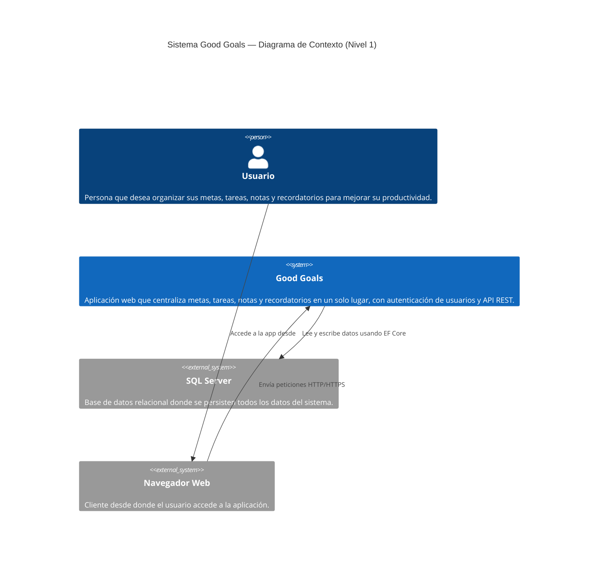
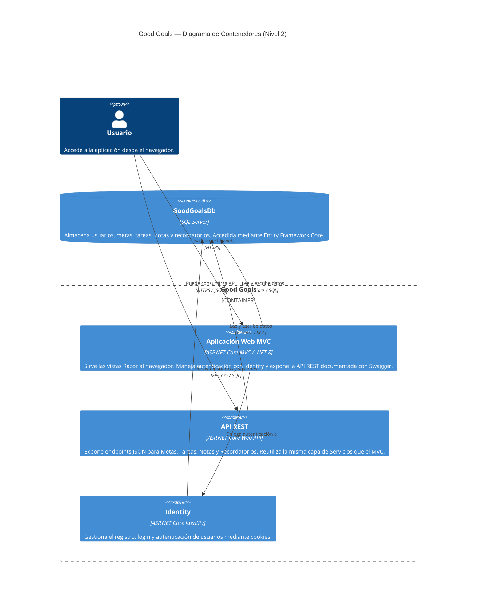
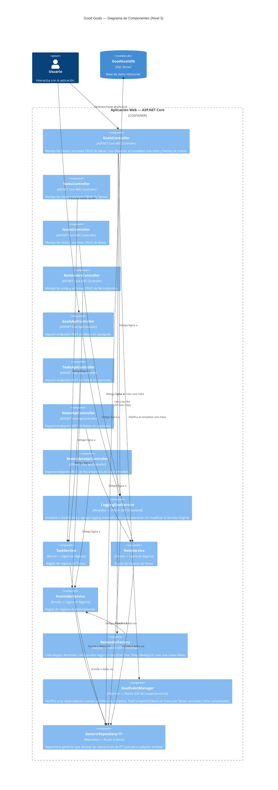

# Modelo C4 — Good Goals

Documentación de la arquitectura del sistema Good Goals usando el Modelo C4 (Niveles 1, 2 y 3), escrita como código con Mermaid.

---

## Nivel 1 — Contexto

**¿Para quién es?** Para cualquier persona (técnica o no) que quiera entender qué es el sistema y quién lo usa.

**¿Qué pregunta responde?** ¿Qué hace Good Goals y con qué sistemas externos se relaciona?

---
---
Nivel 2 — Contenedores
¿Para quién es? Para desarrolladores y arquitectos que necesitan entender las piezas técnicas principales del sistema.
¿Qué pregunta responde? ¿Cuáles son los contenedores (aplicaciones, bases de datos) que componen Good Goals y cómo se comunican entre sí?

---
Nivel 3 — Componentes
¿Para quién es? Para el equipo de desarrollo que trabaja directamente en el código del sistema.
¿Qué pregunta responde? ¿Qué hay dentro de la aplicación web principal? ¿Cómo se organizan los controladores, servicios, repositorios y patrones GOF?

